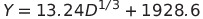
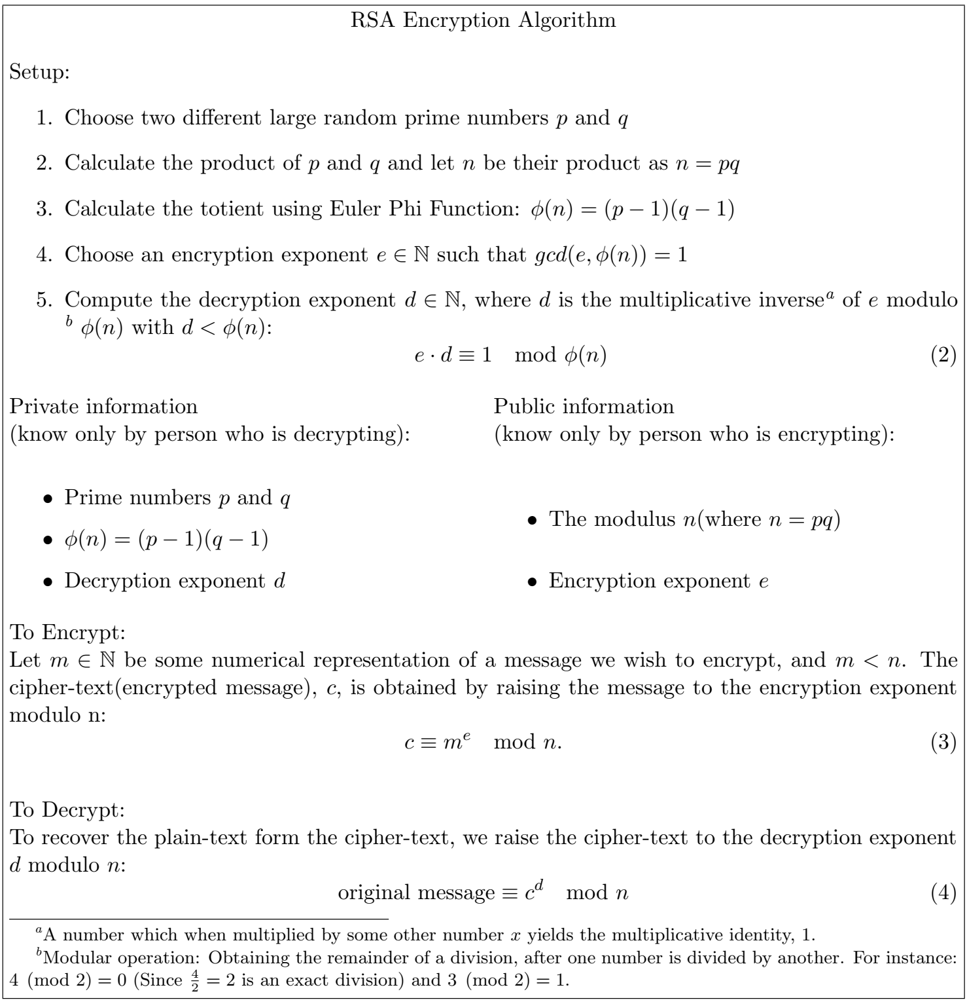

<h1>Public Key Cryptography<h1>
 
<p>
<h2>Introduction</h2>
 Cryptography is not a modern product. It existed a long time ago to protect the sensitive message, especially for communication between kingdoms or warfare. There existed two main types of classical cipher coding methods, namely replacement and substitution. Rearrange the letters in the plain-text, the letters themselves do not change, but their positions have changed. The password made in this way is called a replacement password. The simplest replacement password is to reverse the letters' order in the plain text and then cut it into a fixed-length letter group. The substitution password is to replace characters in plain text with other characters. The whole point was to carry out a special transformation of information into <i>cipher-text</i> according to the agreed rules among the parties. However, most classic methods using simple mechanical tools to protect secrets, which are undoubtedly very simple and easy to crack today. Strictly speaking, it may be difficult to be called cryptography. Consequently, people developed more sophisticated methods to encrypt messages. One of the encrypting concepts is the <i>public key cryptography</i>.
</p>
 
<p>
<h2>Public Key Cryptography</h2>
The concept of <i>public key cryptography</i>(also know as <i>asymmetric cryptography</i>) was proposed by Merkle, Diffie, and Hellman in the mid-1970s<a href="#diffie1976">[2]</a>. After the concept proposal, one of the earliest and most important public-key cryptosystems is invented by Adleman, Rivest, and Shamir in 1977. The cryptosystem is named after their initials, <i>RSA</i><a href="#rivest">[5]</a>. RSA Algorithm is widely used among numerous public key algorithms such as <i>Diffie-Hellman key exchange, Digital Signature Algorithm, </i>and <i>Elliptic Curve Digital Signature Algorithm</i>. Public key cryptography is extensively used in the software world to provide digital signatures to numerous authentication types, from software updates to online transactions.
<br>
 Why is it called <i>public</i>, when we want to avoid the exposure of the message? The <i>public key</i> is used to encrypt messages, whereas a <i>private key</i> is used to decrypt messages. The public key is distributed to everyone who needs to encrypt some information, while the private key is kept secret. We wish to arrange the system so that even if one knows the public key, it is computationally infeasible to compute the private key based on the public key. The system we seek resembles a <i>trapdoor</i>, through which one can pass easily in one direction but cannot pass in the other direction without great difficulty. RSA Algorithm satisfies these requirements easily.
</p>


<p>
<h2>Importance</h2>
An important role of public-key encryption is to deal with the distribution of keys. In this respect, there are two different aspects of using public-key encryption:
<ol>
  <li>Distribution of public keys;</li>
  <li>Using the public key to encrypt a message and distribute private keys<a href="#mollin">[4]</a>.</li>
</ol>
<br>
The following analysis of these two aspects.
<h3>Public key certificate</h3>
Public-key encryption means publishing a key to everyone; therefore, if there is a widely accepted public key algorithm (such as RSA), any participant can send his key to other participants or broadcast his key to the group. Although this method is very convenient, it also has a big disadvantage: anyone can forge public announcements; that is, a user can pretend to be user *A* to send public keys or broadcast public keys to other participants. It takes time for user *A* discovers the forgery and warn other participants. The forger can read the encrypted message trying to send *A* and use the fake public key for authentication.
<br>
The solution to this problem is to use public-key certificates. A public-key certificate consists of the entire data block signed by the public key plus the public key owner's user ID and a trusted third party. Usually, the third party is a certification center trusted by the user community. The user can submit his public key to this *A* through a secure channel to obtain a certificate. The user can then issue this certificate. Anyone who needs the user's public key can obtain this certificate and verify its validity with the attached trusted signature<a href="#mollin">[4]</a>.
</p>

<p>
<h3>Key distribution</h3>
When using traditional encryption, two parties' essential requirement to communicate securely is to share the key. Suppose Bob wants to create a message request to exchange emails securely with the other party. Here, "the other party" refers to someone who can access the Internet or share other networks with Bob. Assuming Bob wants to use a traditional password to do this, Bob and his correspondent (Alice) must build a channel to share a unique key that no one else knows. 
<br>
 How did they do it? If Alice is in Bob's next room, Bob can generate the key, write it on paper, store it on a disk, and then give it to Alice. However, if Alice is in Europe or the other side of the world, what should Bob do? He can encrypt the key with traditional encryption methods and send it to Alice by email. But this means that Bob and Alice must share a key to encrypt this new key. Bob and anyone else who uses this new email package face the same problem as their potential correspondents: any pair of correspondents must share a unique key<a href="#mollin">[4]</a>.

 One solution to this problem is to use the Different-Hellman key exchange. This method is indeed widely used<a href="#diffie1998">[1]</a>. However, this scheme also has its shortcomings. For example, the simplest form of Differ-Hellman cannot provide authentication for two communicators.
A good alternative is to use public-key certificates. When Bob wants to communicate with Alice, he can follow the steps below :
<ol>
  <li> Prepare the message;</li>
  <li> Use one-time session keys to encrypt messages using traditional encryption methods;</li>
  <li> Use Alice's public key to encrypt the session key using public-key encryption;</li>
   <li> Attach the encrypted session key to the message and send it to Alice. Only Alice can decrypt the session key and restore the original message(Since Alice has the private key to decrypt). If Bob obtains Alice's public key through Alice's public key certificate, Bob can determine that it is a valid key <a href="#mollin">[4]</a>.</li>
</ol>
</p>

<h3>RSA cryptosystem</h3>
The idea of the RSA encryption algorithm was initially to create a mathematical trapdoor based on generating a long digit number by multiplying some large prime numbers. It is difficult to go in the opposite direction, which is factoring large numbers. It is feasible to compute the factor of a product within 100 to 200 digits long numbers in modern computers. In 2005, the research team of F.Bahr, M.Boehm, J.Franke, and T.Kleinjung earned a $20,000 prize from RSA Laboratories for factoring out the following 193-digit number:
<br>
```
31074182404900437213507500358885679300373460228427275457201619488
23206440518081504556346829671723286782437916272838033415471073108
50191954852900733772482278352 5742386454014691736602477652346609.
```
<br>


To compute the solution, they took over five months of calendar time with approximately 30 years of processor time on a machine of 2.2GHz Opteron processors. RSA Laboratories proposed several new and more difficult factoring challenges. One of them is of a 617-digit number and was estimated to be factored in 2041. The estimation follows a unique formula that was given by Richard Brent at Oxford University Computing Laboratory:
<br>

<p align="center">

</p>

<br>
for the year *Y* in which the number *D* digits would be factored. It is an extrapolation of the historical data about when different numbers were factors<a href="#rivest">[5]</a>. RSA Algorithm is composed as the following:

<p align="center">

</p>


<h2>Public key management solution</h2>
<p>
From the perspective of system scalability and algorithm security, entity authentication and session key negotiation in space networks should be implemented using public-key cryptographic algorithms. First, suppose a scheme based on a symmetric cryptosystem is adopted. When the number of nodes in the network increases, the key management center needs to exchange information with each node, resulting in a lot of additional communication overhead, while the scheme based on the public key cryptosystem does not exist such a problem. 
<br>
There are fewer key operations when the number of nodes is increased or decreased. The scalability is robust; secondly, the security of public-key cryptographic algorithms is generally much higher than that of symmetric cryptographic algorithms that can effectively improve the security scheme's security. Finally, adopting a key management scheme based on public-key cryptosystems has been tested in practical applications for many years and is also the main development direction in the future <a href="#ekert1991">[3]</a>.
From the research on secure routing, secure handover, and secure transmission technology, it can be seen that public keys are mainly used for mutual authentication and session key negotiation between nodes in the protocol process and to ensure the confidentiality of interactive information under certain conditions. Integrity and non-repudiation. The public key management solution focuses on solving key generation, distribution, update, and revocation.
</p>


<h2>Future of Cryptography</h2>
<p>
Quantum cryptography is a brand-new concept that relies on the theoretical basis of physics as the security model of cryptography. Simply put, it is based on individual photons and their inherent quantum properties to research and develop more advanced and secure new cryptographic systems. Because a quantum system cannot determine the system's quantum state without interfering with the system, and the Heisenberg uncertainty principle can almost guarantee that quantum cryptography has become an unbreakable code<a href="#ekert1991">[3]</a>.
<br>
Post-quantum cryptography and quantum cryptography are two sides of the same coin. According to the current development trend, it is expected that large quantum computers will run successfully around 2020, and all public-key cryptographic algorithms used to protect data security in the network will be breached. However, it is 2020, and this computer does not seem to exist yet. At present, theoretical analysis is based on 1997. The algorithm proposed by Shor can already conquer RSA, DSA, and ECDSA using quantum computing. Nevertheless, this does not mean that the use of classical cryptosystems to protect information is hopeless. Judging from the theories and algorithms provided by current cryptography, it is there are still several cryptosystems that quantum computing cannot conquer.
<br>
Also, there are other cryptographic systems, such as DNA codes and chaotic codes. However, most of these systems are still theoretical, without practical application, and research is relatively unpopular<a href="#ekert1991">[3]</a>.
<br>
DNA cryptography is a new field of cryptography that has emerged with the research of DNA computing in recent years. Its characteristic is to use DNA as the information carrier and modern biotechnology as the realization tool to tap the inherent high storage density, high parallelism, and low consumption of DNA. Many people believe that it will be possible to parallel traditional cryptography and quantum cryptography. Become the three major branches of cryptography. However, to keep pace with the well-developed traditional cryptography and the theoretically complete quantum cryptography, it still needs a long-term theoretical framework and practical operation. At this stage, the research on DNA cryptography is gradually unfolding in academia.
<br>
Chaotic systems have strong pseudo-random characteristics. Their typical characteristics are sensitive dependence on the initial state of the system and control parameters, ergodicity of each state, good pseudo-randomness, and unpredictability of orbit, and continuous broadband power spectrum. The relationship between these fundamental characteristics of chaos and cryptography was mentioned in Shannon's paper as early as 1949. Two basic principles for guiding cryptographic design in cryptography were put forward: diffusion and chaos. Chaotic systems can be applied to cryptography due to their characteristics.

</p>

<h3>References</h3>
<p>
<a id="diffie1998">[1]    Whitfield Diffie. “The first ten years of public-key cryptography”. In:<i>Proceedings of the IEEE76.5 </i>(1988), pp. 560–577.</a>
 
<a id="diffie1976">[2]    Whitfield Diffie and Martin Hellman. “New directions in cryptography”. In:<i>IEEE transactionson Information Theory22.6 </i>(1976), pp. 644–654.</a>

<a id="ekert1991">[3]    Artur K Ekert. “Quantum cryptography based on Bell’s theorem”. In:<i>Physical review letters67.6 </i>(1991), p. 661.</a>

<a id="mollin">[4]    Richard A Mollin.<i>RSA and public-key cryptography</i>. CRC Press, 2002.</a>

<a id="rivest">[5]    Ronald L Rivest, Adi Shamir, and Leonard M Adleman.<i>Cryptographic communications systemand method</i>. US Patent 4,405,829. Sept. 1983.</a>
</p>
